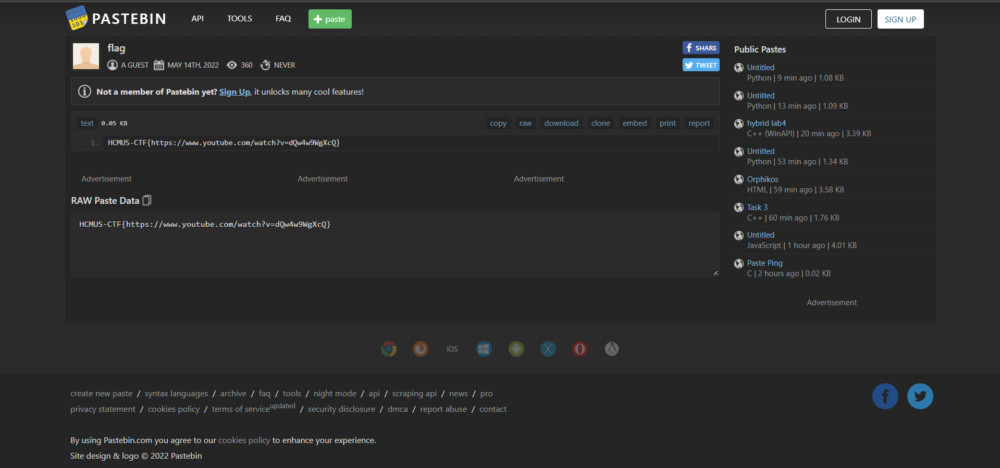
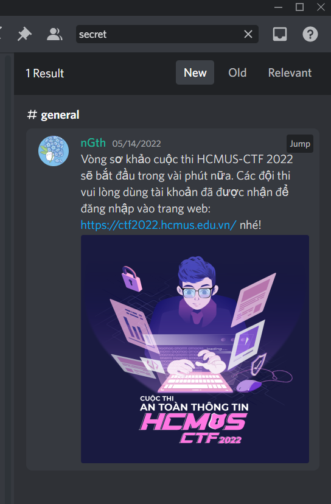

# Super secret (50)

`Challenge nói rằng một thành viên trong team đã leak thông tin bí mật trên discord.`

`Creator: Fluoxetine`

Sau khi lên discord, thì đầu tiên mình tìm profile của Flouxetine. Và mình thấy rằng trong bio có đường link dẫn đến pastepin. Lúc này mình nghĩ là flag sẽ có ở đó nhưng thật ra chỉ là link rickroll

Sau một hồi lâu trên discord mò kim đáy bể mà mình vẫn chưa tìm ra được. Mình đã thử search thử từ `secret`và bất ngờ thay có một tin nhắn hiện ra

Nhưng từ `secret` lại không có trong các dòng tin nhắn. Điều đó cho thấy rằng nó chỉ có thể trong tấm ảnh thôi.

Sau khi mình mở tấm ảnh lên thì quả nhiên ở cuối URL chính là flag

Flag: `HCMUS-CTF{c291872ada763ed9a480eca240552890}`